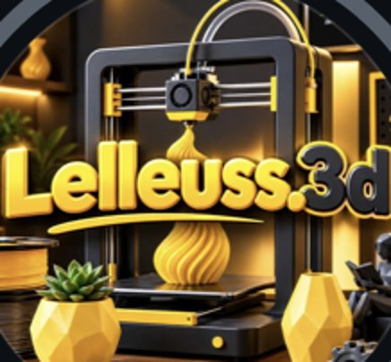
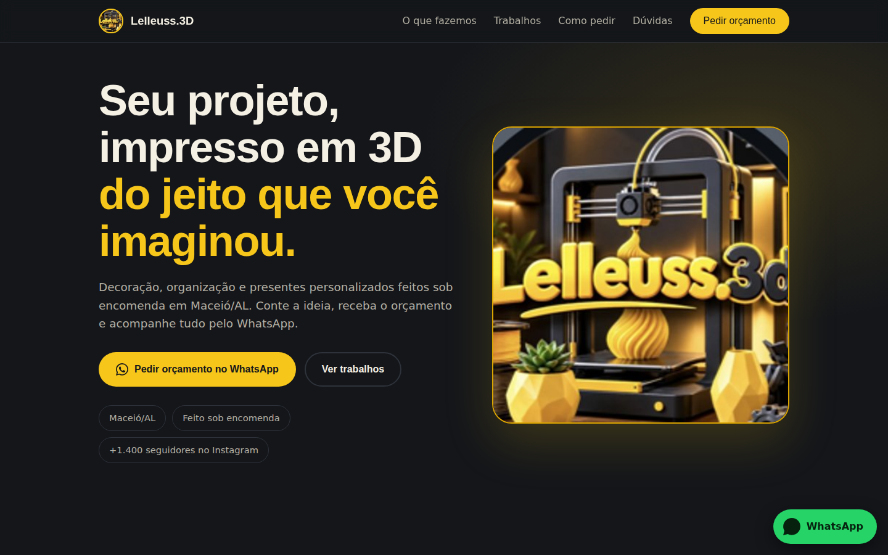
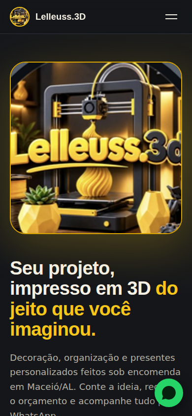
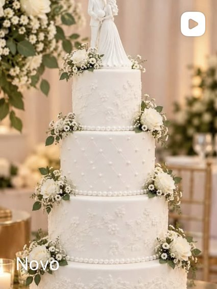
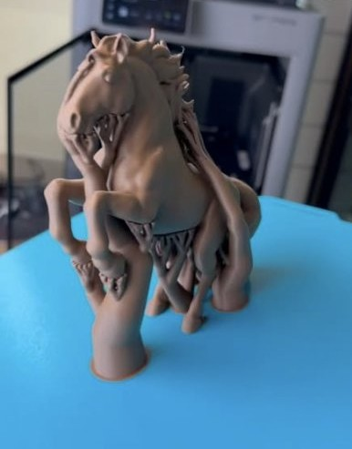
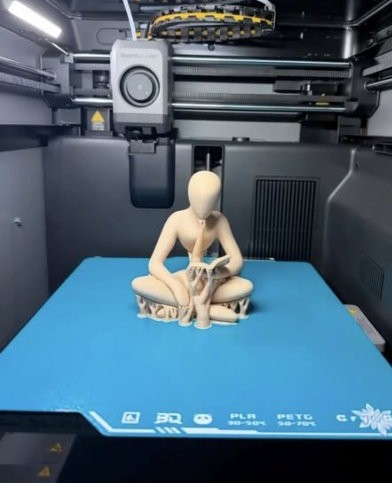

<div align="center">



# Lelleuss.3D — Landing Page

**Landing page de alta conversão para um negócio de impressão 3D em Maceió/AL.**
Decoração, organização e presentes personalizados, com pedidos direto pelo WhatsApp.


</div>

---

## Pré-visualização

<div align="center">



<br><br>



</div>

## Sobre o projeto

Projeto de LandingPage criado para o perfil do Instagram **@lelleuss.3d**, um pequeno negócio que produz peças impressas em 3D sob encomenda. O objetivo foi transformar visitantes do perfil em pedidos de orçamento, usando uma oferta clara, exemplos de trabalhos reais e um botão fixo de WhatsApp.

A identidade visual vem direto da logo da marca: preto grafite, amarelo e dourado.

## Funcionalidades

- Botão fixo de WhatsApp, sempre visível durante a rolagem
- Seção principal com logo, título e duas chamadas para ação
- Serviços: decoração, organização e presentes personalizados
- Galeria com peças reais do perfil
- Passo a passo de como fazer o pedido
- Formulário de orçamento que abre o WhatsApp com a mensagem já preenchida
- Perguntas frequentes com o elemento nativo `<details>`
- Menu mobile, rolagem suave e animações de entrada ao rolar a página
- Respeita a preferência `prefers-reduced-motion`
- Layout responsivo, de celulares pequenos a telas grandes

## Galeria

<div align="center">





</div>

## Paleta de cores

| Token      | Cor               | Hex       |
| ---------- | ----------------- | --------- |
| `--bg`     | Grafite           | `#14161a` |
| `--yellow` | Amarelo da marca  | `#f6c61b` |
| `--gold`   | Dourado           | `#d9a300` |
| `--ink`    | Branco quente     | `#f5f0e4` |
| `--wa`     | Verde do WhatsApp | `#25d366` |

## Tecnologias

- **HTML5** com marcação semântica
- **CSS3** com variáveis customizadas, Grid e Flexbox
- **JavaScript puro** (menu, links do WhatsApp, formulário, IntersectionObserver)
- **Google Fonts**: Bricolage Grotesque e DM Sans

## Estrutura do projeto

```
lelleuss-site/
├── index.html
├── style.css
├── README.md
└── img/
    ├── logo.jpg
    ├── cake.jpg
    ├── horse.jpg
    ├── figure.jpg
    ├── preview-desktop.png
    └── preview-mobile.png
```

## Próximos passos

- [ ] Trocar o número de WhatsApp de exemplo pelo real
- [ ] Usar uma versão da logo em maior resolução
- [ ] Adicionar mais peças à galeria
- [ ] Criar uma seção de depoimentos de clientes
- [ ] Publicar no GitHub Pages

## Observações

Este é um projeto de portfólio. O nome da marca, a logo e as fotos pertencem ao perfil **@lelleuss.3d**.

---

<div align="center">

Feito por <a href="https://github.com/<Nicolasdev25>">Nicolas Leão</a>

</div>
